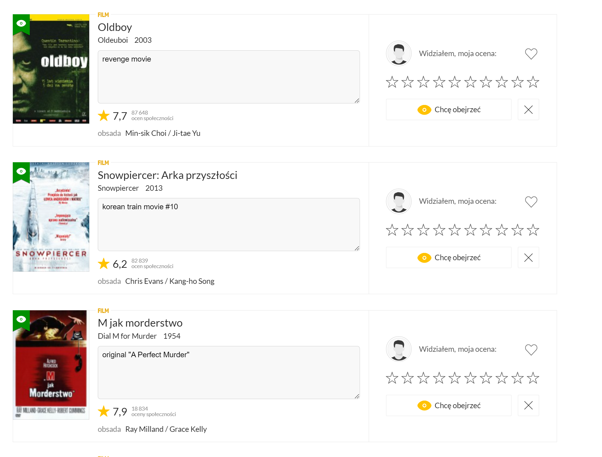

## Makes it possible to add a note to each film on filmweb.pl
Notes are stored in Chrome sync storage.  
### Works in individual film/serial pages:

### As well as in /wantToSee (Chce zobaczyć):

Created with a little bit of help from ChatGPT.